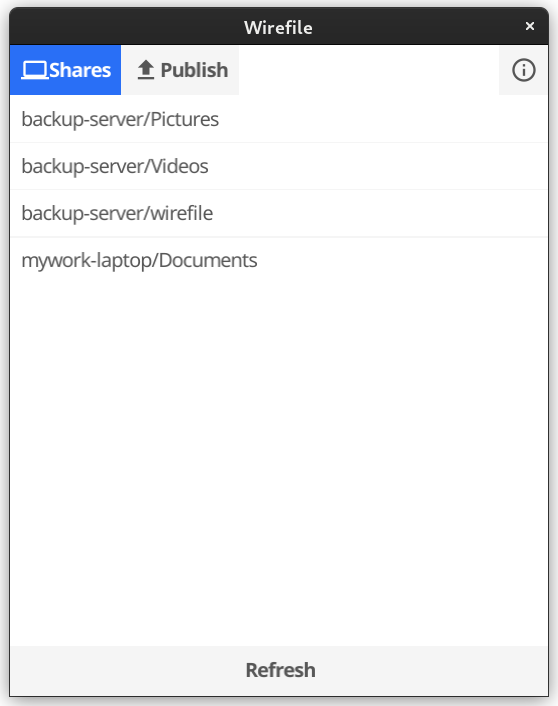

Wirefile

Cross-platform P2P file/folder transfer.

**NEEDS MORE WORK, FOR NOW ONLY DEMO!!**

**NOTE:** *THIS REPO IS USED FOR TRACKING RELEASES*

# About
If you want just to be able to **simply** send **directly** files/folders between devices and avoid any uploading to cloud services just to download, this tool is all about that.

In core, it uses `webrtc` tech to establish **e2e encrypted** connection and transfer data **directly** between your devices.

**Wirefile clients** connect to server only for ***signaling, authentication and some metadata exchange***.

# Clients
Metadata is **never** about content of files, but sharing like file tree names makes clients faster exploring.

Wirefile is totally developed in `Go` language.

Same GUI design on all platforms: 

## CLI tool 
Todo...

